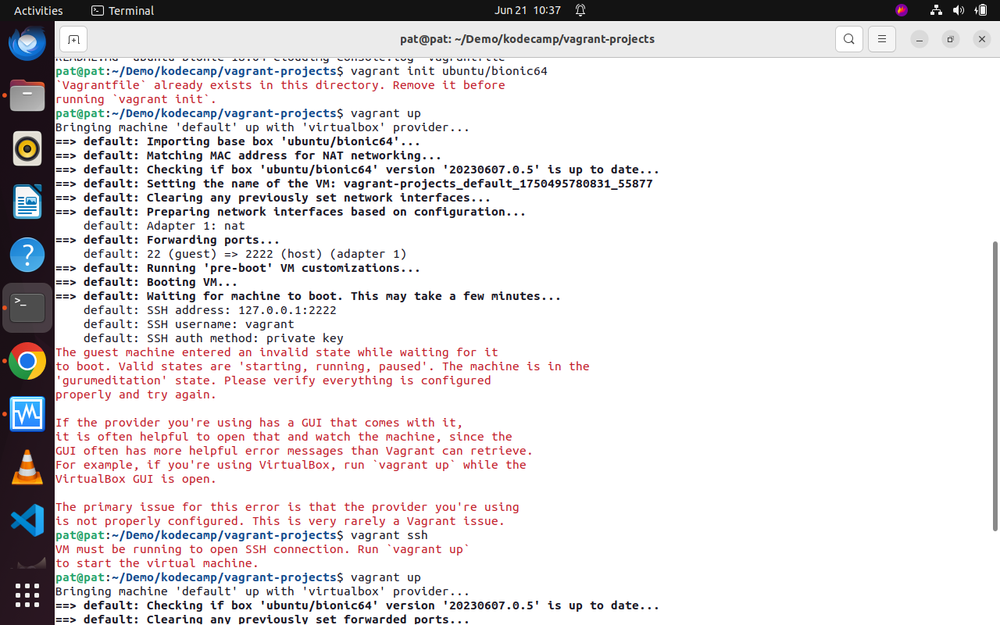
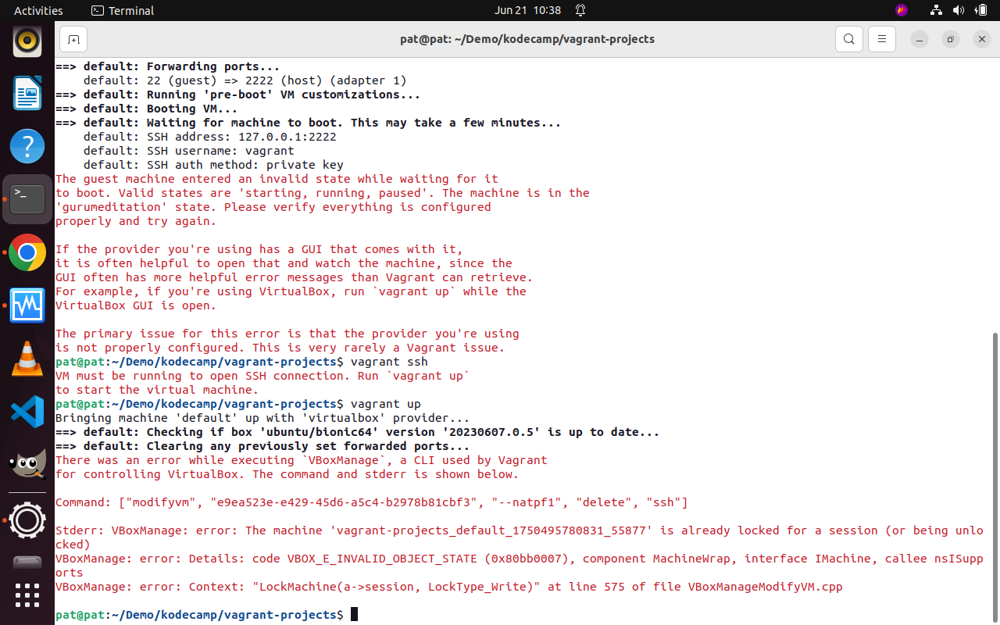
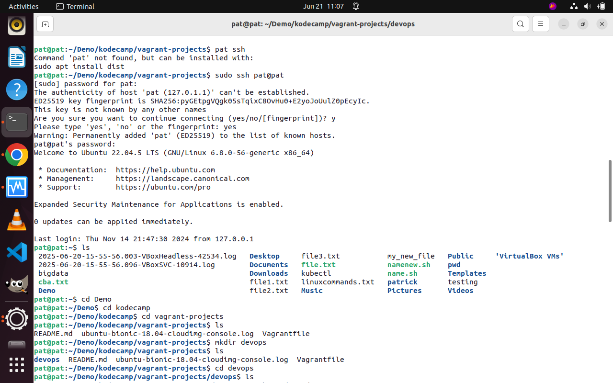
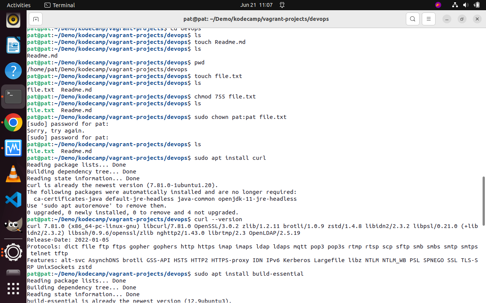
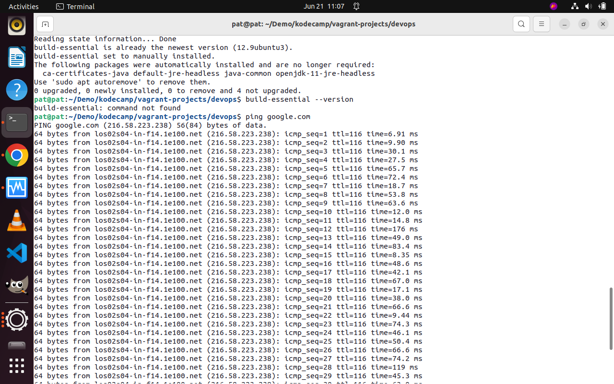
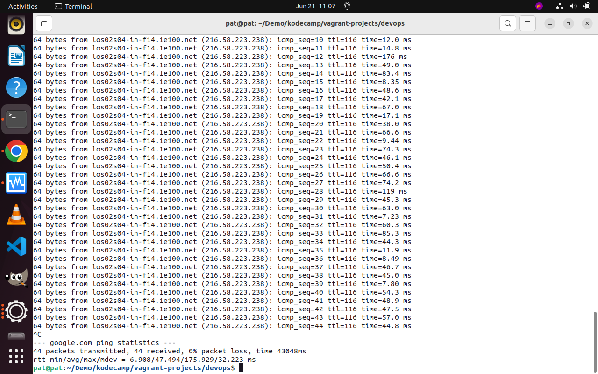

# vagrant-projects
my vagrant projects
I will explore the linux file system and other functions in linux
# Linux Fundamentals Project with Vagrant

1. In this project i was able to create a new github repository "vagrant-projects" in my github account with a readme.md file.

## 2. Setting up Vagrant environment.

I encountered errors setting up vagrant server, maybe because i am running an UBUNTU OS. i was able to install vagrant, init vagrant but when i ran the "vagrant up" command it prompt error.

## 3. Linux file system

In this step, i explored the linux directory structure, then created "/Demo/kodecamp/vagrant-projects/devops". The devops directory is intended to hold various project directories.

## 4. Manage file permissions and Ownership

In this step, i created a file named "file.txt" and used chmod to set it permissions to 755. this means the owner has full permissions to the owner and read/wexecute permissions to the group and others.
Also, i used the chown to change the file ownership to user "pat" and the group "pat".

## 5. Package Installation.

In this step i used apt to install the "curl" package and verified the installation by checking the version with "curl --version".

## 6. Remote Connectivity Test

In this step, i used the ping command to test connectivity to google dns server, the output shows the Round trip time for each packet sent and received, indicating the latency.

